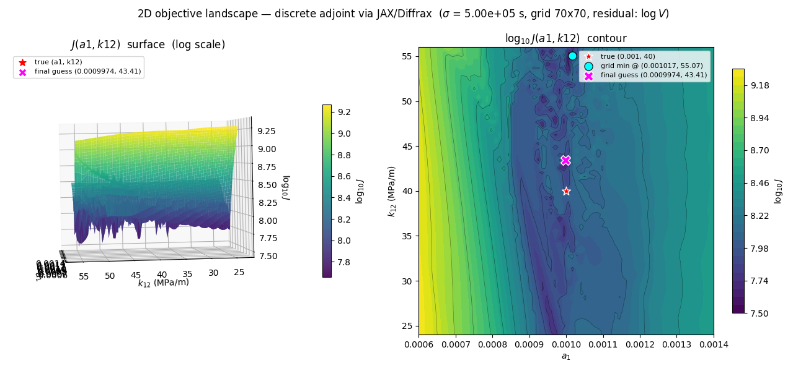

# spring-slider-sensitivity

Gradient-based inversion for rate-and-state friction parameters in 1-D and 2-block spring-slider models of afterslip. The active gradient path for the two-block problem is a **discrete adjoint via JAX/Diffrax automatic differentiation**, which backpropagates through the actual adaptive ODE stepper and scales independently of the number of parameters.

## Overview

The forward model integrates a DAE (force balance + ODEs for slip `u` and state `psi`) using an adaptive embedded RK solver. The objective is `J = 0.5 * ∫(Su - Su_obs)² dt` where `S` is a Gaussian smoothing operator on a fixed reference grid, and the inversion uses `scipy.optimize.minimize` (`trust-constr`) or `basinhopping`, with physical bounds and parameters normalised by their initial values.

**Gradient path (two-block, `p ∈ {a1, a2, k0, k12}`):** the model is rewritten in JAX with a differentiable Newton root-find (Optimistix, in `log V`) eliminating `V` inside the ODE RHS, then Diffrax's `Dopri8` stepper is reverse-mode-differentiated using `RecursiveCheckpointAdjoint`. Cost ≈ `O(1) ×` forward solve regardless of parameter count, so this scales naturally to larger parameter vectors. AD-vs-FD validation agrees to `rel_err ≲ 1e-4` after a step-size sweep.

## Why not the continuous adjoint?

An earlier version used the continuous adjoint. With adaptive time stepping and fast slip events (ruptures), the continuous adjoint becomes inconsistent with FD: it integrates against forward-grid-interpolated Jacobians whose denominator `tau_V + eta` pinches near rupture, producing spurious blowup. Two independent adjoint solvers (explicit RK3 and implicit Radau) agreed with each other but disagreed with FD by many orders of magnitude on long horizons.

An intermediate numpy **forward sensitivity** path (`ds_x/dp` integrated alongside the nominal state) also sidestepped the issue but scaled linearly in the number of parameters and has been retired in favour of the discrete-adjoint-via-AD path. The discrete-adjoint differentiates the actual discretisation rather than a continuous PDE whose discretisation drifts from the forward grid.

## The objective landscape is complex

Even with a correct gradient, the two-block misfit is **highly non-convex and rough**. The 2D `J(a1, k12)` sweep from `slip_discrete_adjoint_double_springslider.ipynb`:



Visible features:

- **Long narrow ridges and valleys** — `J` varies by orders of magnitude across a thin ridge but is nearly flat along it, so descent stalls or zig-zags.
- **Many shallow local minima** clustered near the true parameters (red star at `(0.001, 40)`). The grid minimum (cyan circle) and the recovered inversion result (magenta X) sit in different basins from the truth despite all three being within a few percent in `a1`.
- **Small-amplitude high-frequency texture** from the adaptive stepper boundary changing across the parameter grid, even at `Dopri8` with `rtol=1e-11, atol=1e-13`. Loosening tolerances makes this dominate the basin structure.

Practical consequences:
- Local optimisers (`trust-constr`, `L-BFGS-B`) reliably descend into *a* nearby minimum but rarely the global one. Use `basinhopping` or multi-start for any meaningful inversion.
- The gradient is correct — local-minimum trapping is a property of the objective, not a gradient bug.
- The smoothing scale `sigma` in `S` is the main lever for regularising the landscape: larger `sigma` washes out high-frequency structure at the cost of resolving fewer features.

## Physics

- **Friction law:** regularised rate-and-state, `τ = N·a·arcsinh(V/(2V₀) · exp(ψ/a))`
- **State evolution:** aging law (Dieterich), `dψ/dt = (b·V₀/dc)·exp(-(ψ-f0)/b) - b·V/dc`
- **Two-block force balances** (Abe & Kato 2013 topology — Plate ↔ k0 ↔ Block1 ↔ k12 ↔ Block2 ↔ k0 ↔ Plate):
  ```
  τ₁ + η·V₁ + (k0+k12)·u₁ - k12·u₂ = τ₀,₁ + k0·V_bg·t
  τ₂ + η·V₂ + (k0+k12)·u₂ - k12·u₁ = τ₀,₂ + k0·V_bg·t
  ```

## Module structure

```
friction_derivs.py   ← physics primitives, smoothing matrix, IC setup
adapt_fwd_solve.py   ← adaptive RK forward solver (numpy reference / sanity check)
adjoint_solve.py     ← single-block continuous adjoint (legacy)
compute_obj.py       ← legacy J and dJ/dp helpers (continuous adjoint / forward sensitivity)
landscape_worker.py  ← process-pool worker for the legacy numpy J landscape scan
adjoint_tests.py     ← JAX landscape drivers (run_J_landscape_jax, run_J_landscape_2d_jax)
                       plus legacy FD validation + landscape driver
```

The discrete-adjoint notebook is self-contained: it re-implements the two-block forward in JAX so AD can trace end-to-end, but still imports `setup_initial_conditions_2block` and `make_smoothing_matrix` from `friction_derivs.py`, and uses the numpy `forward_solve_adaptive_2block` as a sanity-check reference.

## Notebooks

- **`slip_discrete_adjoint_double_springslider.ipynb`** — two-block, discrete adjoint via JAX/Diffrax (current main notebook). JAX rewrite of the model, Optimistix root-find for `V` in `log V`, `Dopri8` with `RecursiveCheckpointAdjoint`, AD-vs-FD step-size sweep, 1D and 2D objective-landscape scans, inversion via `trust-constr` and `basinhopping`.
- **`slip_adjoint_double_springslider.ipynb`** — two-block continuous adjoint (legacy; superseded by the discrete-adjoint notebook).
- **`slip_adjoint_springslider_adapttime.ipynb`** — single-block continuous adjoint (legacy).
- **`visualize_objective.ipynb`** — objective function visualization.

Edits to `.py` modules are picked up automatically via `%autoreload 2`.

## Key implementation notes

- **`tau_fn` runs in log-space.** `log_xi = log(V) - log(2V0) + psi/a`, then `arcsinh(exp(log_xi)) = log_xi + log1p(sqrt(1 + exp(-2 log_xi)))`. Forming `V/(2V0)*exp(psi/a)` directly would overflow at steady state (`psi/a ~ 600`) and the reverse pass would silently zero `d(tau)/d(logV)`, sending Newton to NaN.
- **The smoothing matrix `S`** uses trapezoidal integration weights on each column for non-uniform grids; for the inversion it is built once on a fixed uniform reference grid `t_ref` and reused for every iterate.
- **`SaveAt(ts=t_ref)`** returns the JAX forward solution directly on `t_ref`, so the gradient AD computes matches the `J` the optimiser sees by construction.
- **Initial conditions** (`u_0`, `psi_0`, `tau0_1`, `tau0_2`) are **frozen** across iterates. Recomputing them per iterate introduces implicit `a`-dependence in `psi_ss(a)`, `tau0(a)` that AD does not track through the closure, biasing the gradient.
- **`jax_enable_x64=True` is required** — double precision throughout; `arcsinh` arguments reach ~1e35 during rupture and float32 would be useless.

## References

- Alexe, M. & Sandu, A. (2009). On the discrete adjoints of adaptive time stepping algorithms. *J. Comput. Appl. Math.* 233, 1005–1020.
- Abe, Y. & Kato, N. (2013). Complex earthquake cycle simulations using a two-degree-of-freedom spring-block model with a rate- and state-friction law. *Pure Appl. Geophys.* 170, 745–765.

## Dependencies

Python 3, NumPy, SciPy, Matplotlib, Jupyter (with ipywidgets for interactive plots), optional ffmpeg for saving animations.

The discrete-adjoint notebook additionally requires `jax` (with `jax_enable_x64=True`), `diffrax`, and `optimistix`.
